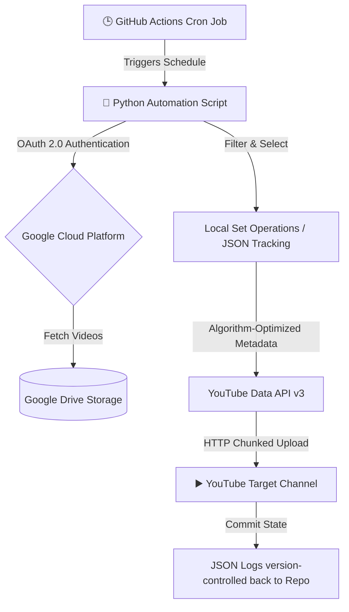

# 🚀 Autonomous YouTube Content Delivery Pipeline
**Serverless Video Syndication via Google Cloud APIs and GitHub Actions CI/CD**

## 📖 Abstract
This project implements a fully autonomous, zero-touch software pipeline designed to fetch, manage, and publish digital media to YouTube. Built as an engineering solution to eliminate the repetitive manual labor of content uploading, the system leverages **Google Cloud Platform (GCP)** APIs and **Continuous Integration/Continuous Deployment (CI/CD)** infrastructure. It achieves a 100% automated "set-and-forget" lifecycle—running flawlessly 365 days a year.

## 🧠 System Architecture

The pipeline operates entirely in the cloud, utilizing GitHub Actions as the compute environment to execute Python scripts against Google's RESTful APIs.

## ✨ Key Technical Subsystems

1. **Unified OAuth 2.0 Authentication**: 
   Instead of using restricted Service Accounts (which YouTube policies block from uploading), this project securely implements hybrid OAuth 2.0 tokens (`token.pickle`) passed dynamically through GitHub Repository Secrets, granting both `drive.readonly` and `youtube.upload` scopes in a single securely injected credential.
   
2. **Deterministic State Management**: 
   A local JSON database schema (`processed_videos.json`, `upload_history.json`) tracks successful permutations. To prevent memory leaks or duplicate processing, the system utilizes Python `set()` functions to instantly parse differences between the Drive index and local history, skipping previously processed data in `O(1)` lookup time.

3. **Resilient Error Handling**:
   The script is fortified against network timeouts, empty JSON tracking files (`JSONDecodeError` bypasses), and OAuth refresh expirations. It will dynamically refresh its own access tokens natively during CI/CD runs.

4. **Algorithmic Metadata Optimization**:
   Through rotating arrays, the application dynamically assigns high-CTR (Click-Through Rate) psychology-based titles and algorithmically optimized SEO tags per upload.

## 💻 Tech Stack
- **Language**: Python 3.11
- **Cloud Infrastructure**: GitHub Actions (Ubuntu Runners)
- **APIs**: YouTube Data API v3, Google Drive API v3
- **Libraries**: `google-api-python-client`, `google-auth-oauthlib`, `json`, `pickle`

## ⚙️ CI/CD Workflow Setup
The workflow trigger is managed by a POSIX-compliant Cron scheduler set within `.github/workflows/youtube_automation.yml`. 
Uploads are scheduled automatically at strategic high-traffic intervals (e.g., IST Timezones):
- `30 5 * * *` (11:00 AM IST)
- `30 8 * * *` (2:00 PM IST)
- `30 15 * * *` (9:00 PM IST)

Credentials (`client_secret.json`, `token.pickle`) are strictly excluded from source control (`.gitignore`) and decoded safely through GitHub Secrets at runtime via Base64 mapping.

## 🎓 Academic Value & Learnings
Building this architecture demonstrates proficiency in:
- **Cloud-native Serverless computing**
- **Token-based API security authentication** models (OAuth vs Service Accounts)
- Building **idempotent scripts** (safe to run multiple times without causing duplicate outputs)
- Orchestrating **Automated DevOps Pipelines**

---
*Developed by Karthikeya Podicheti | Engineering & Computer Science project demonstrating applied automation.*
